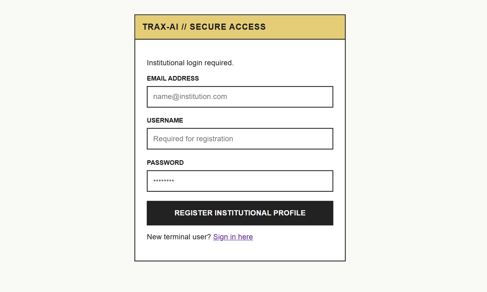
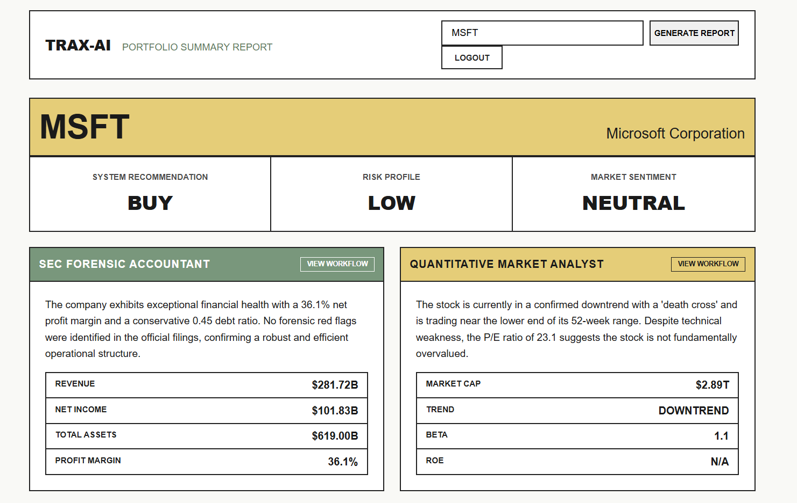
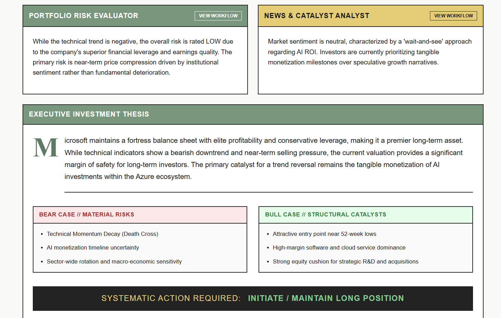
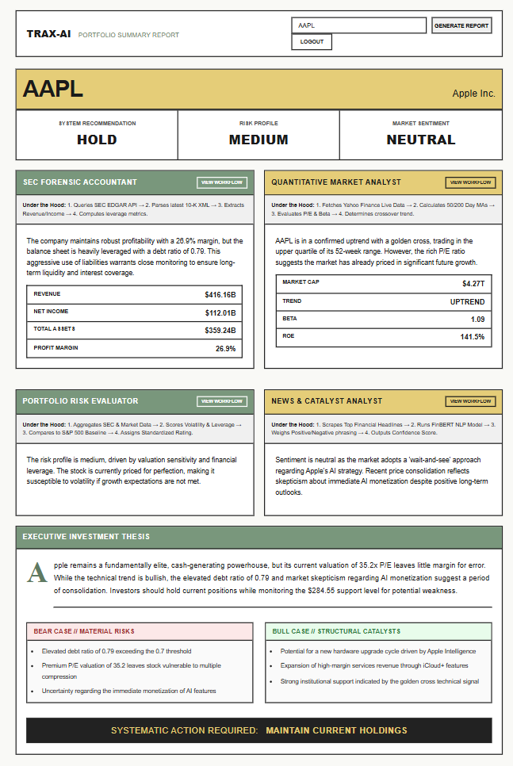

# Trax-Enterprise
CrewAi - Enterprise Finance Intelligence Platform🏦👩🏻‍💻

Trax.ai is an AI-powered stock research platform designed to simplify investment analysis. Instead of manually reading financial statements, tracking market trends, and monitoring news sentiment, users can enter a stock ticker and receive a comprehensive investment report generated by multiple specialized AI agents.

### Key Features
- 📄 SEC Filing Analysis - Extracts and analyzes company fundamentals directly from SEC EDGAR filings.
- 📈 Market Intelligence - Evaluates valuation metrics, financial ratios, and technical indicators from live market data.
- 📰 News & Sentiment Analysis - Uses FinBERT to assess financial news sentiment and identify market-moving events.
- 🤖 Multi-Agent Research Workflow - Specialized AI agents independently analyze fundamentals, risk, sentiment, and market trends before synthesizing a final recommendation.
- 🎯 Investment Recommendations - Generates structured BUY, HOLD, or SELL recommendations with supporting rationale, risks, and opportunities.
- 🔒 Portfolio & Report Management - Enables users to save analyses, track portfolios, and access previous research reports through a secure authenticated dashboard.

<h3 align="center">🏗️ System Architecture</h3>

  

---

<h3 align="center">🖥️ User Interface</h3>

<table align="center">
<tr>
<td align="center">
 
<b>Secure Login</b>
</td>

<td align="center">
 
<b>Dashboard</b>
</td>
</tr>

<tr>
<td align="center">
 
<b>Stock Analysis</b>
</td>

<td align="center">
 
<b>Generated Report</b>
</td>
</tr>
</table>
#### Future scope
1. WebSocket-based real-time status updates.
2. Distributed task processing with Celery.
3. Cloud deployment and automated CI/CD.
4. Global market support beyond SEC-listed stocks.
