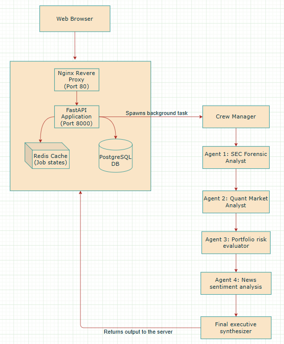

# Trax-Enterprise
CrewAi - Enterprise Finance Intelligence Platform🏦👩🏻‍💻

Trax.ai is an AI-powered stock research platform designed to simplify investment analysis. Instead of manually reading financial statements, tracking market trends, and monitoring news sentiment, users can enter a stock ticker and receive a comprehensive investment report generated by multiple specialized AI agents.

### Key Features
- 📄 SEC Filing Analysis - Extracts and analyzes company fundamentals directly from SEC EDGAR filings.
- 📈 Market Intelligence - Evaluates valuation metrics, financial ratios, and technical indicators from live market data.
- 📰 News & Sentiment Analysis - Uses NLP to assess financial news sentiment and identify market-moving events.
- 🤖 Multi-Agent Research Workflow - Specialized AI agents independently analyze fundamentals, risk, sentiment, and market trends before synthesizing a final recommendation.
- 🎯 Investment Recommendations - Generates structured BUY, HOLD, or SELL recommendations with supporting rationale, risks, and opportunities.
- 🔒 Portfolio & Report Management - Enables users to save analyses, track portfolios, and access previous research reports through a secure authenticated dashboard.

### Overview of architecture

  

---

### Agent Architecture & Persona Design

Every agent is built using three pillars: a **Role** (defining identity), a **Goal** (defining operational boundaries), and a **Backstory** (establishing psychological profile and reasoning bias).

#### 1. Senior SEC Filing Analyst (`sec_analyst`)

**▸ Design Persona**  
A cynical forensic accountant with a Big Four auditing background. Skeptical by nature, this agent trusts audited, official filings over market hype.

**▸ Objective**  
Extract core raw data from annual 10-K filings to compute operational metrics.

**▸ Dedicated Tool**  
`fetch_sec_financials` - Interacts with the SEC EDGAR system via company CIK numbers.

#### 2. Quantitative Market Analyst (`market_analyst`)

**▸ Design Persona**  
A data-driven hedge fund quantitative researcher who thinks purely in terms of algorithmic technical momentum and relative metrics.

**▸ Objective**  
Establish the macroscopic direction of the stock price and isolate technical crossovers.

**▸ Dedicated Tool**  
`fetch_market_data` — Wraps yfinance to retrieve live market feeds and historical distributions.

#### 3. Portfolio Risk Evaluator (`risk_evaluator`)

**▸ Design Persona**  
An institutional risk officer whose primary directive is capital preservation over raw yield generation.

**▸ Objective**  
Score the asset across five distinct dimensions:

- Volatility
- Leverage
- Earnings Quality
- Valuation
- Liquidity

**▸ Dedicated Tools**

- `fetch_market_data`
- `fetch_sec_financials`

#### 4. Financial News & Sentiment Analyst (`news_analyst`)

**▸ Design Persona**  
A sell-side market research analyst tracking public perception, real-time macro catalysts, and emotional market trends.

**▸ Objective**  
Evaluate immediate momentum and short-term upcoming catalysts.

**▸ Dedicated Tool**  
`fetch_news_sentiment` - Queries the News API and processes text strings.

#### Future scope
1. WebSocket-based real-time status updates.
2. Distributed task processing with Celery.
3. Cloud deployment and automated CI/CD.
4. Global market support beyond SEC-listed stocks.
